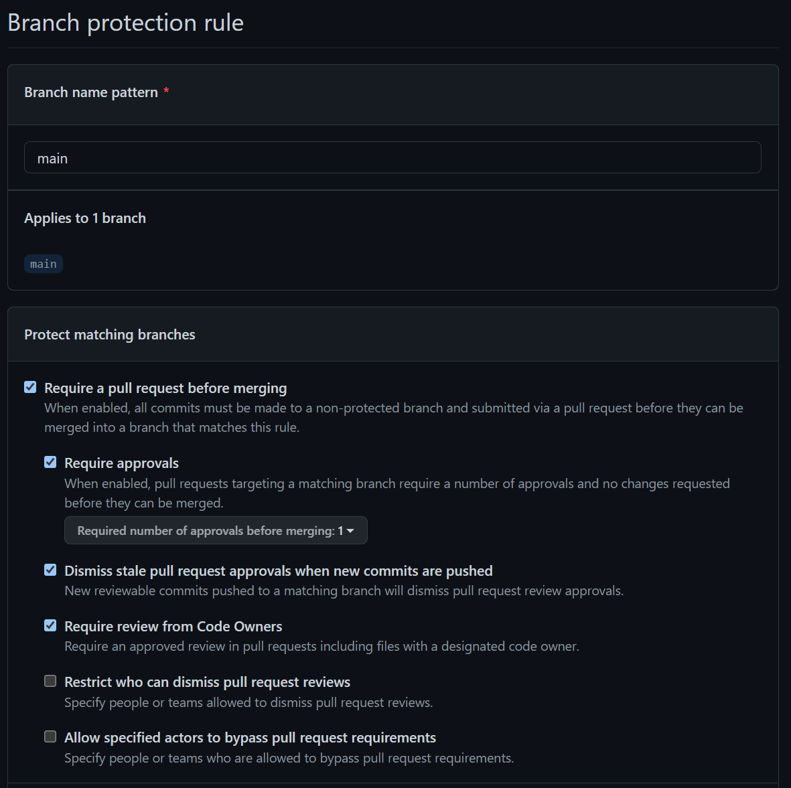

# Problem Statement
Our customer has asked for solution that can ensure peer reviews are taking place for the repositories within their organization.
With "hundreds" of repositories, the solution must work at scale for the organization with, ideally, out-of-the-box settings that can help enforce these activities.

# Approach
When ever approaching a problem such as "peer reviews", I always take a step back and ask an important question.
> Are trying to solve a people problem with a process?

It's important to consider the how/why this ask is coming about.
Far too often, organizations are merely checking off a box on some list to ensure quality and security standards are being met.
If we take a closer look at their process or their workflow, are the developers being given the proper time to do peer reviews?
Are there enough developers with the proper expertese to do peer reviews?
These questions start to paint a picture of how an organization is operating which not tells us how successful the solution will be, but how painful it will be to properly implement. More on that point later.

Once I understand how the organization operates, I can then look to understand what solution(s) will fit their needs.

# Solution
If we take the problem statement at face value, there are several options to ensure that peer reviews are taking place.
The best out-of-the-box solution is simply to turn on branch protections in GitHub.
To do this, we either need to make certain assumptions about the organization or have a discussion on their branching/merging strategy.
For the point of this discussion, we'll assume the organization is using GitHub Flow or some other form of trunk based development.

With this assumption in mind, we simply turn on branch protections for the default branch for the repo (often `main`):

As you can see by the image above, we specify the branch name and mark off the following settings:
- Rquire Approvals
  - This will enforce a minimum number of reviewers
- Dismiss stale pull request approvals when new commits are pushed
  - This will reset approvals when a new commit comes in. This is important since depending the change, it could introduce new issues
- Require Review from Code Owners
  - This is to leverage a powerful feature inside of GitHub and that's to specify who owns the code and there should review the change
  - For information, please see [About Code Owners][codeowners] in the GitHub docs
- Include administrators
  - This is to make sure administrators also follow the rules of the repo
  - Administrators can temporarily turn this off to help get work pushed through, but it's best to leave on at all times

Now that we know what settings we want for a branch protection rule, the question is how to deploy at scale.

One option would be to write a script that would, in a one-time fashion, simply apply the branch protection policy to all repositories.
GitHub has an extensive API, so this works great to get us up and running, but quickly falls apart over time.
It would have to be run on a set schedule to ensure not only new repositories get the policy set, but also prevent people from making changes.

The ideal solution in this scenario would be to leverage GitHub's webhooks for at the organization level.
There is an extensive number of events supported, for a full list see [Webhook events and payloads][webhook_events] in the GitHub docs, but we only care about two of them; `branch_protection_rule` and `push`.

The `push` event fires everytime a push to a repository takes place.
This means that when new repositories are create and the initial push is made, the branch protection will be applied.
This also means that as repositories recieve updates, the policy will get turned as well.

Listening for the `branch_protection_rule` allows us to make sure that rules are immediately turned on if they are turned off.
Depending on the organization and their needs, this could simply be skipped if a way to bypass the rules is needed and the "Include administrators" is checked off.

# Practicality
It's important to have a serious conversation as to the practaclity of this solution.
As we can see, the solution is not technically feasible, but it is simple to achieve.
The real question is *should we* do this? The answer will depend on the organziation's understanding of the limitiations of what this will do.

First and fore most, this solution will not prevent "rubber stamping".
Depending on the organization's culture, this will just create a friction point which people will simply go in and hit the "Approve" button without taking the time to review the code in depth.
If the teams are already under intense pressure to deliver, turning this on will not improve quality or security.
In fact, this solution may have negative impacts since the reason code reviews are not taking place could simply be due to not having the time.

Second, this may only solve part of the problem.
If teams don't have the experience or the skills to conduct proper code reviews, this solution won't be able to fill in the gaps.
For that, we need to concider the development activities taking place inside the repository
Tools like Static Code Analysis (SCA) can help teams identify potential bugs, security issues, and/or technical debt.
Teams should consider leveraging tools like GitHub Advanced Security or SonarQube/SonarCloud.
Status checks could then be incorporated into the repositories CI/CD workflows.
The pull requests could then require status checks to ensure the pull request cannot be approved without having the identified issues resolved.

[codeowners]: https://docs.github.com/en/repositories/managing-your-repositorys-settings-and-features/customizing-your-repository/about-code-owners "About Code Owners"
[webhook_events]: https://docs.github.com/en/developers/webhooks-and-events/webhooks/webhook-events-and-payloads "Webhook events and payloads"